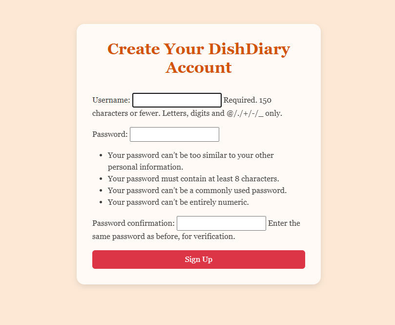

# Dish-Diary 🍽️ - Live Link - https://dish-diary-6fb544588f18.herokuapp.com/

Dish-Diary is a full-stack Django web application that allows users to create, manage, and explore a personal collection of recipes. It supports secure user authentication, full CRUD functionality, and a responsive design optimized for both desktop and mobile devices. Users can interact with recipes by liking, commenting, and saving them to their profile.

---

## ✨ Features

- Register and log in securely
- Create, edit, and delete recipes
- Upload recipe images and ingredients
- Browse recipes by category or keyword
- Save recipes to your profile
- Like and comment on recipes
- Edit user profile details
- Responsive layout for mobile and desktop

---

## 🛠️ Technologies Used

- Django & Python
- PostgreSQL
- HTML5, CSS3, JavaScript
- Bootstrap 5
- Heroku (deployment)
- Gunicorn & WhiteNoise (production setup)

---

## 🚀 Deployment

Dish-Diary is deployed on Heroku using a PostgreSQL database.  
Sensitive configuration values such as `SECRET_KEY`, `DEBUG`, and `DATABASE_URL` are stored securely in Heroku Config Vars and excluded from version control.

---

## 📸 Screenshots & UI Walkthrough

Below are screenshots taken from the deployed Dish-Diary app, showing key features and user flows:

### 🏠 Homepage (Desktop)
  
Displays featured recipes and navigation. Clean layout with category filters.

### 📱 Homepage (Mobile)
  
Responsive version of the homepage, optimized for mobile users.

### 🔐 Login Page
  
Secure login form for returning users.

### 📝 Signup Page
  
User registration form with validation and error handling.

### 🍳 Post a Recipe
  
Form to add a new recipe with title, summary, ingredients, and method.

### 📖 Recipe Detail
  
Full view of a recipe including ingredients, method, and interaction buttons.

### 🧑‍💼 Edit Profile
  
Allows users to update their bio

### 💾 Saved Recipes
  
Displays recipes saved by the user for future reference.

### 🔍 Search Results
  
Shows filtered recipes based on user search input.

### ❌ Delete Confirmation
  
Confirmation prompt before deleting a recipe.

### ❤️ Likes & Comments
  
Displays likes and comments for recipe interactions.

  

  
Alert to show succesfully submitted a comment and a like

---

## 👥 User Stories

- As a new user, I want to register so I can create and save recipes.
- As a returning user, I want to log in securely to access my content.
- As a user, I want to post recipes so I can share my dishes.
- As a user, I want to edit or delete my recipes so I can manage my collection.
- As a user, I want to browse and search recipes so I can discover new ideas.
- As a user, I want to like and comment on recipes so I can interact with others.
- As a user, I want to save recipes to my profile so I can revisit them later.
- As a user, I want the site to work on mobile so I can use it easily.

---
## 🗂️ Project Planning

This project was managed using a GitHub Project Board to organize tasks and track progress. Tasks were prioritized using the **MoSCoW method**, which helped guide development from MVP to feature-rich experience. Project Board Link - https://github.com/users/khizermalik1/projects/6/views/1

### MoSCoW Prioritization

**Must Have**
- User registration to create and save recipes  
- Secure login for returning users  
- Ability to post recipes with title, ingredients, and instructions  
- Edit and delete recipes to manage personal collection  

**Should Have**
- Browse and search recipes by keyword or category  
- Responsive design for mobile and tablet use  
- Save recipes to user profile for later access  

**Could Have**
- Like and comment on recipes to encourage interaction and feedback  

Each user story was mapped to specific tasks in the project board to ensure development stayed focused on user needs and goals.

## 🧬 Design Documentation

Dish-Diary uses a warm, cookbook-inspired visual style designed to feel welcoming and familiar. The interface focuses on readability, soft colours, and clear structure so users can comfortably browse, create, and manage recipes on any device. A mobile-first approach was used to ensure that users can access recipes easily while cooking, with layouts that adapt cleanly between desktop and smaller screens.

## Wireframes

Wireframes were created during the planning phase to outline the structure and layout of the key pages in Dish‑Diary. These wireframes helped guide the visual hierarchy, user flow, and responsive behaviour across desktop and mobile devices.

The following pages were planned using simple conceptual wireframes:

### Homepage
- Hero banner with background image  
- Navigation bar at the top  
- Search bar below the hero  
- “Post a Recipe” button for authenticated users  
- Sections for Most Popular Recipes and Latest Recipes  
- Card‑based layout for recipe previews  

### Recipe Detail Page
- Large recipe image  
- Title, author, and interaction buttons (like, save, comment)  
- Ingredients and method displayed clearly  
- Comment section at the bottom  

### Create & Edit Recipe Pages
- Form layout with fields for title, summary, ingredients and method.
- Submit and cancel buttons  
- Validation messages for required fields  

### User Profile Page
- User bio at the top  
- Sections for saved recipes and user‑created recipes  
- Card‑based layout for recipe previews  

### Authentication Pages (Login & Signup)
- Centered form layout  
- Clear labels and validation feedback  
- Minimal distractions to keep focus on authentication  

Below this section, a wireframe is presented as text‑based ASCII diagram to illustrate the planned structure of each page.

### Homepage Wireframe

<pre>
+--------------------------------------------------------------+
|                          NAVBAR                              |
|--------------------------------------------------------------|
|  [DishDiary Logo]   [Home] [Explore Chefs] [Saved] [Login]   |
+--------------------------------------------------------------+

+--------------------------------------------------------------+
|                           HERO                               |
|--------------------------------------------------------------|
|  [ Background Image (heroimage.webp) ]                       |
|                                                              |
|                 Welcome to DishDiary                         |
|     Cook, share, and discover recipes that bring joy         |
|                     to your kitchen.                         |
+--------------------------------------------------------------+

+--------------------------------------------------------------+
|                        SEARCH BAR                            |
|--------------------------------------------------------------|
|  [ Search Input Field ]   [ Search Button ]                  |
+--------------------------------------------------------------+

+--------------------------------------------------------------+
|                    POST A RECIPE BUTTON                      |
|--------------------------------------------------------------|
|                     [ Post a Recipe ]                        |
+--------------------------------------------------------------+

+--------------------------------------------------------------+
|                   MOST POPULAR RECIPES                       |
|--------------------------------------------------------------|
|  [Card]   [Card]   [Card]   [Card]                           |
|  Title    Title    Title    Title                            |
|  Summary  Summary  Summary  Summary                          |
|  ❤️ Likes 💬 Comments                                        |
|  [View Recipe]                                               |
+--------------------------------------------------------------+

+--------------------------------------------------------------+
|                     LATEST RECIPES                           |
|--------------------------------------------------------------|
|  [Card]   [Card]   [Card]                                    |
|  Title    Title    Title                                     |
|  Summary  Summary  Summary                                   |
|  ❤️ Likes 💬 Comments                                        |
|  [View Recipe] [Edit] [Delete] (if owner)                    |
+--------------------------------------------------------------+
</pre>

## Colour Palette

Dish‑Diary uses a warm, food‑inspired colour palette designed to create a welcoming and homely feel. The colours were chosen to reflect the comfort of cooking while maintaining strong readability and visual consistency across the site.

| Purpose | Colour | Hex |
|--------|--------|------|
| **Main Background** | Soft Peach | `#ffe5d9` |
| **Navbar Background** | Light Peach | `#fff0e6` |
| **Navbar Border** | Warm Coral | `#ffb997` |
| **Primary Accent (Brand, Buttons, Links)** | Deep Orange | `#d35400` |
| **Primary Accent Hover** | Dark Orange | `#a84300` |
| **Card Background** | Peach Coral | `#ffb997` |
| **Card Title** | Deep Red | `#a80000` |
| **Text Colour** | Charcoal Grey | `#3e3e3e` |
| **Focus Outline** | Deep Orange | `#d35400` |

### Why these colours were chosen
- Warm peach tones create a **friendly, inviting cooking atmosphere**  
- Deep orange accents highlight interactive elements and brand identity  
- Charcoal grey text ensures **excellent readability**  
- The palette is consistent across all components, improving UX  

## Typography

Dish‑Diary uses a single primary typeface across the entire site to maintain a consistent and readable visual style.

### Primary Font: Georgia
The project uses the `Georgia` serif typeface for all text elements, including:

- Body text (set globally on the `body` element)
- Navigation links (`.nav-link`)
- Headings and hero text
- Buttons and card content (inherited)

### Font Styling in the Interface
- **Hero Heading (`.hero h1`)**  
  Large font size (`3rem`) and bold weight (`700`) to create a strong visual impact.

- **Hero Subheading (`.hero p`)**  
  Slightly larger than standard text (`1.2rem`) for readability over the hero image.

- **Navigation Links (`.nav-link`)**  
  Styled with `font-weight: 600` to make them stand out while remaining consistent with the Georgia typeface.

Overall, the typography is intentionally simple, relying on a single serif font with variations in size and weight to create hierarchy and clarity.

## Design Rationale

The design choices for Dish‑Diary were made to create a warm, welcoming, and easy‑to‑use recipe platform. The warm peach and coral tones were selected to reflect the comfort and homeliness associated with cooking. These colours also provide strong contrast for text and interactive elements, improving readability and accessibility.

The Georgia serif typeface was chosen for its classic, cookbook‑style appearance, giving the site a friendly and familiar feel. Using a single font across the project keeps the interface consistent and uncluttered.

The layout is built using Bootstrap’s grid system, ensuring clean spacing, responsive behaviour, and a familiar structure for users. Elements such as cards, buttons, and the hero section were styled to be visually clear and intuitive, helping users browse, read, and create recipes without distraction.

## 🧬 Models Overview

Dish-Diary uses Django’s ORM to define the following core models:

- **User**: Built-in Django user model used for authentication and ownership of recipes, comments, likes, and favourites.
- **Profile**: Extends the user with a bio field. One-to-one relationship with `User`.
- **Recipe**: Stores recipe details including title, summary, ingredients and steps. Linked to `User` as author.
- **Comment**: Allows users to leave comments on recipes. Linked to both `User` and `Recipe`.
- **Like**: Tracks how many likes each recipe receives. Linked to `Recipe`
- **Favourite**: Tracks recipes saved by users. Includes a uniqueness constraint to prevent duplicate saves. Link to both `User` and `Recipe`.

 ## 🧬 Entity Relationship Diagram (ERD)

The diagram below illustrates the structure of Dish-Diary’s relational database. It shows how users interact with recipes through likes, favourites, and comments, and how each model connects to others via foreign keys.

- **User ↔ Profile**: One-to-One  
- **User ↔ Recipe**: One-to-Many (author)  
- **User ↔ Comment**: One-to-Many  
- **User ↔ Favourite**: Many-to-Many via ForeignKey  
- **Recipe ↔ Comment**: One-to-Many  
- **Recipe ↔ Like**: One-to-Many  
- **Recipe ↔ Favourite**: One-to-Many  

## 🧪 Testing

- Manual testing across Chrome, Firefox, Safari, and mobile browsers (Can be seen VIA Screenshots above of web app)
- Form validation using Django’s built-in tools
- CSRF protection enabled on all forms
- CRUD operations tested for expected behavior (Can be seen VIA Screenshots above of web app)
- Authentication tested (register, login, logout)
- Responsive layout verified using browser dev tools
- Code Validation using W3C CSS and HTML Validation Service - Some HTML and CSS validation errors are caused by Django template syntax which are not recognized.  
The Lighthouse audit shows a high-performing mobile experience  

### Manual Testing

#### User Registration & Login
- Registered a new user with valid credentials — ✅ successful
- Tried registering with an existing email — ❌ error message displayed correctly
- Logged in and logged out — ✅ working as expected

#### Recipe Creation
- Created a recipe with all required fields — ✅ recipe saved and displayed
- Left required fields blank — ❌ form validation triggered
- Uploaded an image — ✅ image displayed correctly

#### Profile Editing
- Edited profile bio and saved changes — ✅ updates reflected
- Tried saving with empty bio — ❌ validation prevented submission

#### Explore Chefs
- Viewed other user profiles — ✅ links and data loaded correctly
- Tried accessing profile without login — ❌ redirected to login page

#### Saved Recipes
- Saved a recipe — ✅ appeared in saved list
- Removed a saved recipe — ✅ disappeared from list

#### Delete Functionality
- Deleted a recipe from the front end — ✅ confirmation shown, recipe removed

## 🪞 Reflection
This project was a deep dive into building a full-stack web application with performance, accessibility, and maintainability in mind. From setting up the backend with Django to deploying on Heroku, every step challenged me to think critically about structure, speed, and user experience. Going forward, I plan to replace inline styles with consistent, modular CSS to improve maintainability and scalability. Building this app helped me balance speed, structure, and usability.

## 📄 Credits

- Developed by Khizer Malik  
- Hosted on Heroku  
- Database powered by PostgreSQL

---

## 🤖 AI Assistance

This project was developed with support from Microsoft Copilot for setup, configuration, and documentation.
